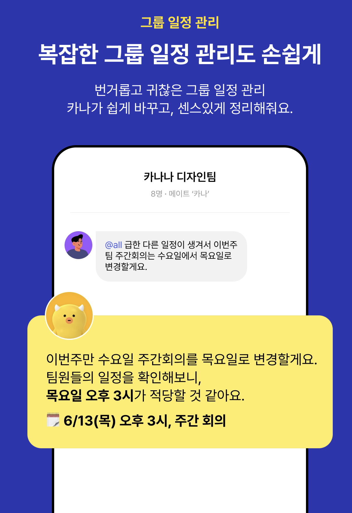
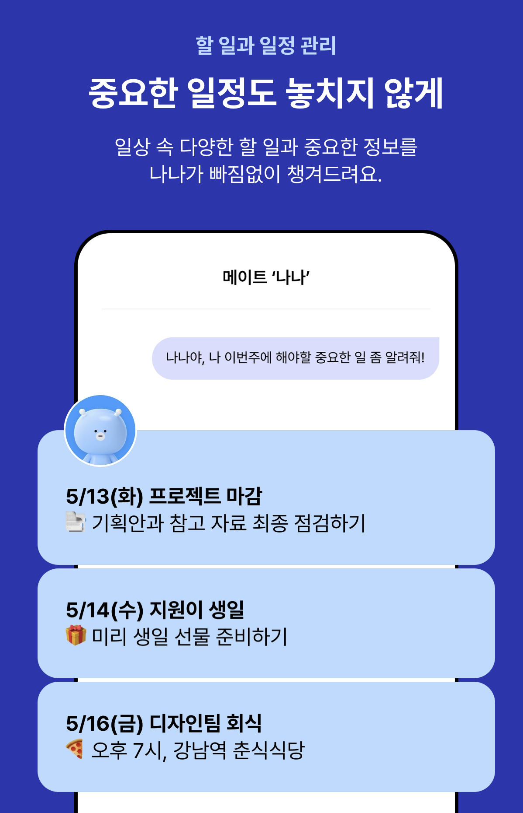
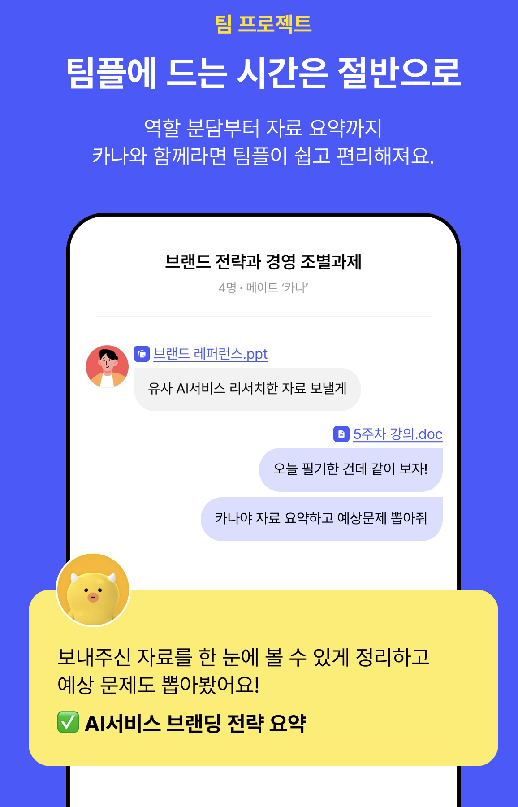
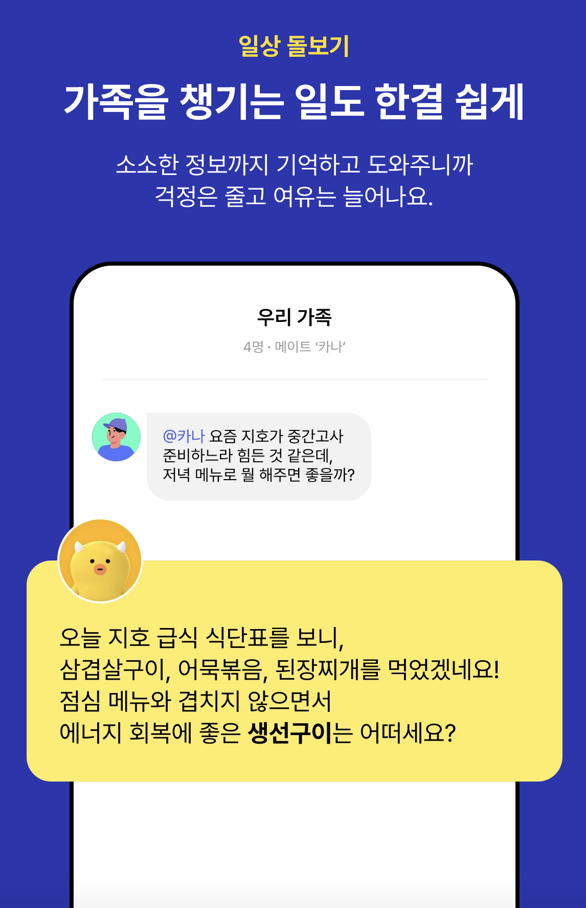
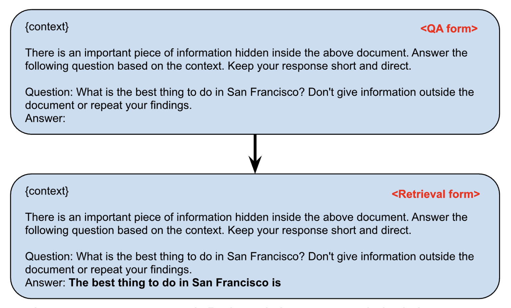

# Kakao

**2. 체인 오브 소트 데이터(CoT, Chain of Thought)**

# **Job description**

- 직원 유형 - 정규직
- 영입인원 - 0 명
- 조직소개
    - 우리 조직은 카카오의 자체 멀티모달 언어모델인 Kanana 시리즈를 연구 및 개발합니다.
    - 이미지-텍스트를 이해하는 Kanana-v(비전 언어모델), 오디오-텍스트 입출력이 가능한 Kanana-a(오디오 언어모델), 다양한 모달리티의 입출력을 통합하는 Kanana-o(멀티모달 통합 언어모델)을 개발하고 있습니다.
    - 모든 형태의 입력과 출력 간 자유로운 상호 이해가 가능한 범용 멀티모달 모델 개발을 목표로, 국내외 최신 연구 동향을 빠르게 분석하고 이를 바탕으로 기술 선도 수준의 모델을 확보하고자 합니다.
- 업무내용
    - 이미지, 오디오, 텍스트 등 다양한 모달리티을 다루는 Multimodal LLM 연구 및 개발
    - Supervised Fine-tuning(SFT) 및 Human Preference Alignment 를 통한 instruction-following 성능 및 모델 안전성 향상
    - 단순 응답부터 복합 reasoning 까지 아우르는 추론 성능 향상 모델링
    - 대규모 분산 학습 환경에서의 모델 학습 코드 개발 및 성능 최적화
    - 멀티모달 학습을 위한 고품질 데이터 수집, 전처리, 정합성 확보 및 구축 파이프라인 설계
    - 멀티모달 모델의 평가 지표 설계 및 벤치마킹, 실사용 시나리오 기반의 성능 검증
- 지원자격
    - 딥러닝 관련 분야 석사 이상 또는 이에 준하는 관련 경력이 2년 이상인 분
    - 주요 딥러닝 프레임워크(PyTorch, TensorFlow, JAX 등) 중 하나 이상을 활용한 경험이 있는 분
    - Python 기반의 코드 개발 및 실험 구현에 능숙한 분
- 우대사항
    - Multimodal LLM 기술 및 관련 서비스 개발 경험이 있는 분
    - CVPR, NeurIPS, ICLR, ICCV, ICML 등 AI 분야 최상위 학회 논문 발표 또는 공동 연구 경험이 있는 분
    - ACM ICPC 등 주요 프로그래밍 대회 수상 경력 또는 이에 준하는 알고리즘 솔빙 역량을 보유한 분
- 지원프로세스
    - ~~서류전형(CV 또는 프로젝트 경력 pdf파일 또는 url 첨부 필수) > 코딩테스트~~ > 사전인터뷰 > 1차 인터뷰(사전과제) > 2차 인터뷰 > 처우 협의 > 최종 합격 및 입사 (※ 영입 진행 상황에 따라 전형이 추가/변경될 수 있습니다.)
- 크루의 한마디
    
    < 우리가 일하는 방식 >
    
    우리는 자율성과 책임감을 바탕으로 함께 일하는 문화를 만들어갑니다.
    
    회사의 공통 원칙을 존중하면서도, 개인의 몰입과 팀의 효율을 극대화할 수 있는 방식으로 유연하게 일합니다.
    
    불필요한 보고나 형식보다 실질적인 성과와 성장에 집중하며, 스스로 목표를 세우고 실행하는 과정을 중요하게 생각합니다.
    
    지속적인 기술 공유와 수평적인 커뮤니케이션을 통해 함께 배우고 성장하는 문화를 만들어갑니다.
    
    연구부터 프로덕트 응용까지, 기술의 전 과정을 함께 고민하고 주도해 나갈 열정적인 분들을 기다립니다.
    
- 근로제도
    - 완전선택근무제
    
    해당 포지션은 월 총 근무시간 범위 내에서 크루 스스로 하루의 업무 시작 및 종료 시간을 설정하여 자율적으로 몰입하여 근무할 수 있는 <완전선택근무제>를 적용받습니다.
    
    - 월 1일 리커버리데이
    
    매월 마지막 주 금요일은 크루의 휴식과 충전을 위한 <리커버리데이>로 운영됩니다.
    
    - 주 1일 원격근무
    
    업무와 협업의 효율성을 우선으로 하여, 리커버리데이가 없는 주에는 <주 1일 원격근무>가 가능합니다.
    

# 자기소개서

## **프로젝트 수행이력 – Examodal: 이미지 및 오디오 모달리티 확장을 위한 멀티모달 LLM 개발**

현재 LG전자 Multimodal Task 팀에서 자체 대규모 언어 모델 기반의 멀티모달 확장 프로젝트인 Examodal 개발을 수행하고 있습니다. 본 프로젝트는 LG의 초거대 언어 모델인 EXAONE을 기반으로 이미지와 오디오 모달리티를 확장하여, 실세계 멀티모달 입력에 유연하게 대응하는 범용 LLM 개발을 목표로 합니다.

Examodal 프로젝트 내에서 저는 공간 기반 시각-언어 모델링(Spatial Vision-Language Model)과 오디오 타워(Audio Tower) 설계 및 학습 파이프라인 구축을 전담하고 있습니다. 텍스트-이미지-오디오 정합성을 확보한 데이터셋을 수집·정제하고, 이를 활용한 멀티모달 SFT (continual learning) 및 DPO 학습을 진행 중입니다. 특히 이미지 모달리티에서는 공간 위치 정보를 반영한 spatial reasoning 태스크를 위해 coco dataset에서 bounding box 를 활용한 referring dataset을 정제하였고, SFT 후 기존 대비 fine-grained grounding 성능 (G-Eval)이 향상됨을 확인했습니다.

오디오 모달리티 측면에서는 오디오 encoder를 이미지 modality가 확장된 Multimodal-LLM에 special token을 대체하여 입력으로 활용할 수 있도록 구현하였습니다. 이를 catastrophic forgetting 문제가 발생하지 않도록 cross-modal continual learning 전략을 적용하여, modality 간 간섭 없이 안정적인 통합 학습이 가능하도록 했습니다. 이를 통해 pretrain 및 SFT를 다시 하지 않고 리소스를 획기적으로 절약하며 오디오에 대한 성능도 가져갈 수 있었습니다.

기술적으로는 PyTorch, HuggingFace Transformers, 그리고 ONNX/Qualcomm SDK 기반 모델 최적화 및 경량화 작업도 수행 중이며, LLM 기반 추론에 특화된 multimodal RAG 구조 설계 와 벡터 DB 구축, web demo application 개발 등 전 주기에 걸친 기술 개발에 참여하고 있습니다.

본 프로젝트에서 저는 멀티모달 데이터 처리 및 구조 설계, 학습 전략 수립, 시스템 최적화 및 응용 전개까지 End-to-End 전 과정을 주도적으로 기획 및 실행하고 있으며, 연구와 제품 개발 간 경계를 허물며 실제 서비스 적용까지 내다보고 있습니다. 이를 통해 Kanana 시리즈가 추구하는 범용 멀티모달 모델 개발의 방향성과 매우 유사한 문제의식을 공유하고 있으며, 실제 성과 창출 경험 또한 갖추고 있다고 자신합니다.

---

> ✅ 사용기술 요약: Python, PyTorch, HuggingFace Transformers, ONNX, Qualcomm SDK, CUDA, FastAPI, LangChain, Llama-index, Docker, COCO, CLIP, Continual Learning
> 
> 
> ✅ 수행역할: 멀티모달 모델 설계 (VLM, Audio Tower), 학습 파이프라인 구축 (SFT, DPO, CL), 정합성 확보된 멀티모달 데이터셋 구축, 모델 평가 및 시스템 데모 구현 전반 담당
> 

## **자기소개서 (2,500자 이내)**

저는 늘 변화하는 기술 환경 속에서 새로운 도전을 통해 성장해왔습니다. 기술을 단순히 사용하는 것이 아니라, **기술의 방향을 이해하고 이를 연구하고 발전시키는 사람**이 되고 싶었습니다. 그 열망은 프론트엔드, 백엔드 개발자로 시작된 커리어를 인공지능 연구자로 전환하게 만들었고, 고려대학교 인공지능 대학원에서 포즈 추정 기반 Computer Vision 연구로 석사 학위를 취득하며 실현의 첫 단계를 밟았습니다.

LG전자에 입사한 뒤, 저는 먼저 **영상지능 TP** 연구원으로 **2D/3D Pose Estimation 및 Action Localization 모델을 TV/IoT 디바이스에 적용**하는 프로젝트를 수행했습니다. 이 과정에서 **Quantization-aware Training, Grouped Attention 설계, RecycleNet 구조 설계** 등 연구 기반의 실험과 실제 제품 적용을 연결하며, 처음으로 AI가 실생활을 바꾸는 구조를 어떻게 설계할 수 있는지에 대한 감각을 키울 수 있었습니다.

이후 멀티모달 task 분야로 팀을 전환하며 LG전자의 초거대 언어 모델 EXAONE을 기반으로 한 **범용 멀티모달 LLM인 'Examodal' 개발 프로젝트**에 합류하였습니다. 본 프로젝트에서 저는 **이미지 및 오디오 모달리티 확장**, 그리고 **cross-modal continual learning 기반 학습 파이프라인 설계**를 담당하고 있습니다. 특히 Spatial Reasoning 강화를 위해 COCO 기반 referring dataset 을 정제하고, fine-grained grounding 성능 향상을 확인했으며, 오디오 encoder와 텍스트 간 입력 통합 구조를 구현하고 재 학습이 아닌 continual learning을 활용하여 pretrain에 들어가는 리소스를 줄이며 modality 확장에 기여했습니다. 이 과정에서 PyTorch, HuggingFace Transformers, ONNX/Qualcomm SDK 등 다양한 프레임워크 기반으로 **모델 설계, 학습, 추론, RAG 시스템 구축, 웹 데모 구현까지 End-to-End**로 수행 중입니다.

이처럼 저는 **Computer Vision 기반 연구 경험을 바탕으로 멀티모달 LLM 개발자로 빠르게 전환하고, 기술 트렌드에 맞는 구조적 문제 해결 능력을 실제 시스템에 반영**해 왔습니다. 단순히 주어진 업무를 처리하는 것이 아니라, 모델의 한계를 고민하고 구조적 개선안을 제안하는 과정에 깊이 관여해왔습니다.

한편, 연구자로서도 활발한 활동을 이어가고 있습니다. WACV, Neural Networks, Pattern Recognition 등 주요 학회에 **총 6편의 논문을 제1·공저자로 발표**하였으며, **CVPR 및 ICCV Reviewer로 참여**하며 최신 연구 흐름을 빠르게 파악하고 실전에 적용해왔습니다. 이 경험은 단지 기술을 구현하는 데 그치지 않고, **아이디어를 정립하고 검증하며, 논문으로 설득하는 연구적 태도와 논리**를 제게 길러주었습니다.

무엇보다 저는 기술에 대한 몰입과 도전정신이 강한 사람입니다. 익숙한 영역에 안주하지 않고, 끊임없이 새로운 기술을 파고들며 다음 문제를 고민합니다. Vision 중심의 연구에서 멀티모달 언어 모델 분야로, 다시 실시간 inference 및 모델 압축 등 응용 단계로 이동하며, 저는 **기술과 연구, 실전의 연결 고리를 끊임없이 확장하고 있습니다.**

카카오 Kanana 시리즈가 추구하는 **범용 멀티모달 언어모델의 개발 철학**은, 제가 지금까지 고민해온 방향성과 깊이 맞닿아 있습니다. 연구와 프로덕트 사이의 경계를 넘어서는 팀에서, 저는 빠르게 자리를 잡고 실질적인 기여를 해낼 준비가 되어 있습니다. 기술로 세상을 이해하고 바꾸는 일에 있어, 저는 언제나 앞장서고자 합니다.

# 코딩 테스트

1. 시계열 암호 해독

```python
def decrypt_caesar(ciphertext: str, k: int) -> str:
    k = k % 26  # 양수든 음수든 mod 26으로 순환 처리
    decrypted = []

    for ch in ciphertext:
        shifted = (ord(ch) - ord('A') - k) % 26
        decrypted.append(chr(shifted + ord('A')))

    return ''.join(decrypted)
```

- 음수도 나머지는 같은 형태로 나오므로 26으로 나누고 시작. A 로부터 얼마나 떨어져 있는지 구한 후 암호 해독해 append 후 리턴
1. 단어 그래프 dp

```python
def longest_deletion_chain(words):
    word_set = set(words)
    memo = {}
		# top down dfs 시간 초과
    def dfs(word):
        if word in memo:
            return memo[word]
        max_len = 1  # 자기 자신 포함
        for i in range(len(word)):
            next_word = word[:i] + word[i+1:]
            if next_word in word_set:
                max_len = max(max_len, 1 + dfs(next_word))
        memo[word] = max_len
        return max_len

    return max(dfs(word) for word in words)

# top down dfs 제거 후 bottom up dp
def longest_deletion_chain(words):
    word_set = set(words)
    dp = {}  # dp[word] = longest path starting from this word

    # 길이 순 정렬 → 짧은 단어부터 처리
    for word in sorted(words, key=len):
        dp[word] = 1  # 최소 길이: 자기 자신
        for i in range(len(word)):
            prev = word[:i] + word[i+1:]
            if prev in word_set:
                dp[word] = max(dp[word], dp[prev] + 1)

    return max(dp.values())
```

- **TOP-DOWN:**  단어 문자 하나하나 제거하면서 wordset에 길이 하나 짧은 next word 가 존재하면 next_word를 dfs하면서 짧은 단어부터 memo에 저장하고 리턴하게 하여 최적화. but 재귀 호출 여러 번
- **BOTTOM-UP:** 짧은 단어부터 시작하면 → 제거된 형태의 단어들이 먼저 처리됨 → 따라서 정렬 후 각 단어의 최장 경로 길이를 **bottom-up 방식으로 누적**할 수 있음 → **DFS + memo 대신 DP 테이블 한 번만 순회로 끝냄**
1. 사라진 조직도
- 문제 설명 및 해결 전략
    - **초기 조직도**는 (부모, 자식) 관계로 주어짐
    - 이후 조직도가 삭제돼서 **동작만 남음**
    - 쿼리 유형:
        - `create_teams a b`: a 팀의 하위에 b 팀 추가
        - `delete_teams b`: b 팀과 모든 하위 팀 삭제
        - `count_teams a`: a 팀과 그 하위 팀 수 출력
    
    ---
    
    ❗ 흔한 실수
    
    1. 트리 구조만 저장하고, **삭제된 팀을 계속 순회**함 → 틀림
    2. 삭제 시, **존재하지 않는 팀을 고려**하지 않음 → 틀림
    3. count 시 **삭제된 팀 포함** → 틀림
    
    ---
    
    ✅ 핵심 설계
    
    1. `tree`: 부모-자식 트리
    2. `exists`: 현재 존재하는 팀만 추적하는 집합
    3. DFS로 `count` 및 `delete` 수행할 때 `exists`만 순회

```python
from collections import defaultdict
import sys
sys.setrecursionlimit(1000000)

class OrgChart:
    def __init__(self):
        self.tree = defaultdict(list)
        self.exists = set()
    
    def add_initial(self, parent, child):
        self.tree[parent].append(child)
        self.exists.add(parent)
        self.exists.add(child)

    def create_team(self, parent, child):
        if parent not in self.exists:
            return  # 무시: 부모가 삭제된 팀이면 추가 불가
        self.tree[parent].append(child)
        self.exists.add(child)

    def delete_team(self, team):
        def dfs(node):
            if node not in self.exists:
                return
            self.exists.remove(node)
            for child in self.tree[node]:
                dfs(child)
            # 삭제 후 자식 정보도 제거 (optional)
            self.tree[node] = []
        dfs(team)

    def count_teams(self, team):
        def dfs(node):
            if node not in self.exists:
                return 0
            count = 1
            for child in self.tree[node]:
                count += dfs(child)
            return count
        return dfs(team)
```

- 틀린거 같은 이유 (반만 맞은) → 재귀 리밋 안 늘린게 제일 의심되고, 삭제된 노드 탐색이나 트리 노드 exist 셋 관리 틀린 거 같기도 하다.
    1. sys.setrecursionlimit(1000000)
    2. 삭제 후 `count` 시 삭제된 노드 순회함 → ❌
    3. 존재하지 않는 부모에 자식 추가됨 → ❌
    4. `tree`에는 자식이 남아 있는데 `exists`에 없어서 카운트 오류 발생 → ✅ `exists`만 기준으로 탐색해야 함

# 사전 인터뷰

- 참고
    - 1시간 카카오 아지트 대면 진행
    
    원격 인터뷰에서는 기본적으로 **이력서, 포트폴리오 등에 입력했던 내용이 맞는지에 대한 내용을 확인하는 질문/대답이 많이 오갔다.**
    
    원격 인터뷰에서 내가 바라는 **카카오, 조직 문화 등에 대해서 많은 질문을 했고** 원격 인터뷰는 대부분의 후기가 ‘간단하고 쉬웠다.’ 저의 경우 추천서에 대한 질문, **자격증에 대한 질문, 코딩 테스트의 대한 질문, 직군에서 사용하는 기술스택**에 대한 질문 등 다양한 질문을 주셨고 CS(데이터베이스, 네트워크, 운영체제, 자료구조, 알고리즘, 자바)와 프로젝트에 사용한 기술들의 원리(spring boot, jpa 등등), 프로젝트 관련 내용, 자기소개글에서 중요할 법한 내용들을 모두 노션에 정리해서 하나하나 DFS처럼 궁금한 게 생기면 계속 질문을 만들고 답을 달면서 준비했다.
    
    - 물어보는 거
        - ~~코딩 테스트~~
        - **자기소개 / 지원동기**
        - **~~해당 직무에 대한 지식~~**
        - **~~해당 직무 관련된 깊이 있는 경험~~**
        - **높은 러닝 커브를 증명할 수 있는 경험**
    
    그것은 바로 내가 열심히 살고 러닝 커브가 높다는 것은 알겠는데 **개발의 어떤 분야에 특화되어 있는지**를 모르겠다는 것이었다.
    
    사실 대학교도 졸업하지 못한 쌩신입이, 어떤 분야에 특화될 수 있는지는 의문인지라 CS 기본기가 탄탄하고, 뭐든지 빠르게 배울 수 있는 사람을 원하실 거라고 생각이 들었고,
    
    그래서 거기에 맞춰서 준비했는데 일반적인 백엔드 직무가 아니라 빅데이터 플랫폼 엔지니어링이라는 특수한 직무라 데이터베이스에 특화된 사람을 원하셨던 것 같다.
    
    음 1) 이직이유 & 카카오 지원 동기 2) 그럼 동일한 이슈가 카카오에서도 있으면 이직할건가요? 3) 업무 중 힘들었던 사례와 어떤 과정을 통해 극복했는지, 너가 거기서 기여한건 어떤거가 있는지도! 4) 했던 경험들을 카카오에선 어떻게 살릴껀지/적용할껀지 5) 업무 스타일 (중간보고 방법 및 팀원들과 커뮤니케이션 방법) 
    

## 모의 질문

### 간단한 자기소개

👉 **핵심 경력과 문제의식**,

👉 **Kanana 포지션과의 연결성**,

👉 **앞으로 기여할 준비가 되어 있다는 자신감**

까지 짧고 강하게 전달하는 게 중요합니다.

**🎯 목적:**

- 1분 내외로 “나는 이런 기술적 역량과 문제의식을 가진 사람이고, 이 포지션에 잘 맞는 이유가 있다”는 걸 각인
- **🧾 최종 자기소개 예시 (면접 오프닝용)**
    
    > 안녕하세요, 저는 최신 멀티모달 LLM 구조와 실서비스 응용 사이의 간극을 좁히는 데에 관심을 가지고 있는 연구자 진경민입니다.
    > 
    > 
    > LG전자 인공지능연구소에서 멀티모달 Task 팀 소속으로 자체 언어 모델인 **EXAONE 기반의 Examodal 프로젝트**를 주도했으며, 이미지와 오디오 모달리티를 LLM에 통합하는 **Spatial data 정제 및 Audio Tower**를 설계하고, **Cross-modal Continual Learning** 기반의 학습 파이프라인과 **멀티모달 RAG 시스템**까지 End-to-End로 개발했습니다.
    > 
    > 특히 **instruction-following 성능 향상, 오디오 모달리티 통합, 데이터 수집** 등 Kanana의 목표와 유사한 문제의식 아래, 실제 가정 내 활동 요약 같은 시나리오에 가까운 구조를 직접 설계하고 실험해본 경험이 있습니다.
    > 
    > Vision 분야 연구자 출신으로 **WACV, Neural Networks 등 주요 컨퍼런스 발표 및 CVPR/ICCV Reviewer 활동**도 해왔고, 논문만 읽는 게 아니라 **논문 구조를 실제 모델 설계와 제품으로 연결해내는 실천력**을 강점으로 생각합니다.
    > 
    > Kanana가 추구하는 **일상 속 유용한 AI 메이트**로서의 멀티모달 모델을 함께 고민하고 발전시킬 수 있는 팀에 꼭 합류하고 싶습니다.
    > 
    
    **💡 팁**
    
    - 눈을 보고 자연스럽게 말하세요. **외운 듯하지 않되, 흐름은 머리에 넣어두세요.**
    - “저는 진경민입니다”보다는 **“저는 __ 문제에 관심을 가지고 있는 연구자입니다”** 식으로 문제의식을 먼저 전달하면 훨씬 기억에 남습니다.
    - 마지막 문장은 **Kanana 팀의 방향성과 딱 맞게 연결된 포부**로 마무리해야 좋습니다.
    
    **✅ 한 줄 요약형도 챙겨가세요 (시간 짧을 때)**
    
    > 안녕하세요, 저는 LG전자에서 멀티모달 LLM 구조와 학습 파이프라인을 실제 서비스까지 연결해본 진경민입니다.
    > 
    > 
    > 특히 Examodal 프로젝트에서 이미지·오디오 모달리티 확장과 cross-modal continual learning을 주도했고, Kanana가 지향하는 일상 속 AI 메이트를 위한 기술 구현 경험을 보유하고 있습니다.
    > 

[프로젝트 기반 질문](%ED%94%84%EB%A1%9C%EC%A0%9D%ED%8A%B8%20%EA%B8%B0%EB%B0%98%20%EC%A7%88%EB%AC%B8%202d04ed2198b28008a404dc4d864ddd47.md)

### **✅ 연구자로서의 태도 및 최신 기술 트렌드**

- **Q5. 최근 읽은 multimodal LLM 논문 중 Kanana와 유사하다고 느낀 것이 있다면 소개해 주세요.**
    
    최근 읽은 논문 중 **Microsoft Research의 "Reinforcement Pre-Training (RPT)"** 논문이 인상 깊었습니다. 이 논문은 기존의 next-token prediction을 단순한 예측이 아니라, **reasoning 기반의 task로 재정의**하고, 이에 대해 **verifiable reward를 기반으로 한 reinforcement learning 방식**을 적용한 것이 특징입니다.
    
    Kanana의 대화 흐름 속 reasoning이 강화된다면, 단순 일정 조율을 넘어 **사용자의 우선순위나 의도, 그룹 내 맥락까지 반영한 의사결정 지원 시스템**으로 발전할 수 있다고 생각합니다. 그 기반을 다질 수 있는 기술로서 RPT는 매우 유의미한 인사이트를 제공했습니다.
    
    - MM-react
        
        ~~최근 읽은 논문 중 **“MM-ReAct: Prompting ChatGPT for Multimodal Reasoning and Action” (CVPR 2024)**이 Kanana가 추구하는 방향성과 매우 유사하다고 느꼈습니다.~~
        
        ~~이 논문은 텍스트·이미지·음성 등 다양한 모달 정보를 바탕으로 복합 reasoning을 수행하고, 외부 도구 호출과 사용자 상호작용까지 통합한 **멀티모달 상시 에이전트** 구조를 제안합니다.~~
        
        ~~Kanana가 지향하는 “톡방 속 메이트”로서의 정체성—즉, **대화 맥락 속에서 그룹 구성원 간의 일정 조율, 감정 파악, 이미지/음성 이해, 일정 리마인드까지 연결하는 흐름**은 단순한 generation을 넘는 복합 상호작용 능력을 요구합니다.~~
        
        ~~MM-ReAct는 LLM이 이미지나 음성의 의미를 문맥에 맞게 해석한 뒤, 이를 reasoning 기반 행동(action)으로 연결한다는 점에서, **Kanana가 톡방 대화 속 멀티모달 정보를 통합하고 사용자를 도와주는 방식과 매우 닮아 있습니다.**~~
        
        ~~특히, 이 논문에서는 단순 응답이 아니라 ‘유저의 요청을 상황에 맞게 이해하고 행동을 설계하는’ 에이전트 지향의 접근을 택했다는 점에서, **카나나의 “일정 잡기”, “할 일 리마인드”, “모임 정리” 등의 실제 use case와 기술적 방향성이 맞닿아 있다고 느꼈습니다.**~~
        
        ~~이 논문을 통해 저는 **멀티모달 LLM이 단순히 여러 입력을 처리하는 것을 넘어서, 실시간 context를 기억하고 유용한 도움을 제공하는 방향으로 발전하고 있다는 흐름**을 더욱 확신하게 되었고, Kanana의 구조에도 이러한 research insight가 접목될 수 있다고 생각했습니다.~~
        
        **~~💡 보완 팁~~**
        
        ~~인터뷰 시에는 이렇게 이어서 말하시면 좋아요:~~
        
        > ~~“이 논문을 기반으로 실제로 저도 Examodal 프로젝트에서 이미지 + 오디오 기반 컨텍스트를 통합하는 구조를 설계한 적이 있는데,~~
        > 
        > 
        > ~~Kanana처럼 실생활 속 자연스러운 멀티모달 AI를 만들기 위한 기반 설계로 활용될 수 있겠다는 걸 실감했습니다.”~~
        > 
- **Q5.1. 해당 논문이 Examodal 또는 Kanana에 주는 인사이트는 무엇이었나요?**
    
    인상 깊었던 점은, 기존의 next-token prediction에 국한되지 않고, **reasoning 능력을 중심으로 pretraining을 재정의했다는 점**입니다. 이 구조는 사용자의 복합 요청에 대한 응답 품질을 강화해야 하는 **Kanana의 메신저 기반 대화형 AI 구조**, 그리고 **멀티모달 입력에 대해 정확히 grounding해야 하는 Examodal의 시나리오** 모두에 높은 연관성을 보입니다.
    
    특히 Examodal의 경우, 텍스트·이미지·오디오 정합성을 바탕으로 spatial reasoning,  등의 복합 추론이 요구됩니다. 이때 기존 방식은 대부분 supervised learning 기반으로 학습 데이터를 수동 구성해야 했지만, RPT는 **ground-truth token 자체를 reward로 간주하여 self-verifiable한 학습이 가능**하다는 점에서, **데이터 구축 부담을 줄이면서도 reasoning 중심의 성능을 향상**시킬 수 있는 대안이 된다고 느꼈습니다.
    
    또한 Kanana에서는 그룹 대화 속에서 맥락을 이해하고, 일정 정리나 할 일 관리, 역할 분담 등의 요청을 처리해야 하는데, 이는 모두 단순 응답보다 **상황 이해와 논리 기반 판단이 선행되어야 가능한 작업**입니다. RPT의 강화학습 기반 pretraining은 이런 요구에 부합하는 **논리적 사고력을 사전 내재화**시킬 수 있다는 점에서 강력한 기반 기술이 될 수 있다고 느꼈습니다.
    
    - MM-React
        
        **~~MM-ReAct 논문은 Kanana와 Examodal 양쪽 모두에 의미 있는 인사이트를 주었습니다.~~**
        
        ~~무엇보다도 이 논문은 단순히 멀티모달 입력을 받아 응답을 생성하는 수준을 넘어서, **사용자의 목적과 맥락을 추론해 다음 액션까지 유도하는 “멀티모달 에이전트”의 구조**를 보여줬습니다.~~
        
        ~~이는 단순히 이미지를 해석하거나 음성을 텍스트로 바꾸는 것이 아니라, **대화 흐름 전체를 이해하고 상호작용을 조율하는 Kanana의 구조적 방향성과 정확히 맞닿아 있다고 느꼈습니다.**~~
        
        `~~1` Examodal 프로젝트에서도 저희는 멀티모달 입력을 받아 **spatial reasoning, 오디오 이해, 사용자 context에 맞는 응답 생성**을 설계하면서 **단순 generation보다 "상황을 읽고 반응하는 AI"**를 목표로 했는데, MM-ReAct가 제시한 구조는 저희가 설정한 **Cross-modal Continual Learning 구조와도 철학적으로 유사**했습니다.~~
        
        `~~2` 특히 외부 도구 호출과 멀티 스텝 추론을 LLM을 중심으로 orchestration 하는 방식은 **Examodal의 멀티모달 RAG 시스템 설계나, Kanana의 “일정 잡기 / 역할 정리 / 요약” 등의 기능에도 적용 가능한 프레임워크**라고 생각합니다.~~
        
        ~~또한 이 논문은 실사용 시나리오에 가까운 prompt 설계, 인간적인 응답 흐름, 행동 후 피드백 구조까지 함께 다뤄 Kanana처럼 **“지금 상황에 AI가 뭘 해줘야 가장 도움이 되는가”**라는 사용자 중심의 질문을 고민하는 데 큰 도움이 되었습니다.~~
        
        ~~단순히 LLM을 만드는 것이 아니라 **사용자 경험 중심의 “행동형 AI 모델”을 만들려면 어떤 구조적 요소가 필요한지**에 대한 강한 인사이트를 얻을 수 있었습니다.~~
        
        **~~🗣️ 실전 말하기 흐름 (구어체)~~**
        
        > ~~“MM-ReAct는 단순히 멀티모달 입력에 응답하는 게 아니라, **유저가 원하는 걸 context에서 파악하고, 실제 행동으로 연결해주는 구조**라는 점에서 Kanana의 방향성과 닮아 있다고 느꼈어요.~~
        > 
        > 
        > ~~특히 저희 Examodal에서도 텍스트-이미지-오디오 정합성을 학습하고, 사용자 목적에 따라 반응을 설계하는 구조를 고민하고 있었는데, 이 논문을 통해 **에이전트 구조 설계와 멀티 스텝 reasoning의 방향성**을 더 명확히 잡을 수 있었어요.~~
        > 
        > ~~이 논문은 실사용 시나리오에 가까운 prompt 설계, 인간적인 응답 흐름, 행동 후 피드백 구조까지 함께 다뤄 Kanana처럼 **“지금 상황에 AI가 뭘 해줘야 가장 도움이 되는가”**라는 사용자 중심의 질문을 고민하는 데 큰 도움이 되었습니다.~~
        > 
        > ~~그래서 저희 내부에서도 Web demo 구성이나 RAG 파이프라인 설계할 때, 단순 응답이 아니라 “행동 유도형 응답 흐름”을 설계하게 된 배경이 됐습니다.”~~
        > 
- **Q5.2. 모델 구조, 데이터 구성, alignment 방식 중 특히 눈여겨본 포인트는?**
    
    **RPT 논문에서 특히 눈여겨본 부분은 모델 구조나 데이터가 아니라,기존 token-level objective를 강화학습 reward로 재해석한 alignment 방식 자체였습니다.**
    
    기존 LLM은 next-token prediction 방식으로 학습되지만, 이는 항상 "이전 문맥"에만 조건을 두고 응답을 생성하는 구조입니다. 반면 RPT는 각 token의 예측이 단순히 맞느냐 틀리느냐가 아니라, **전체 문장의 목적 하에 얼마나 유의미한 결정인지**를 평가하는 방식으로 학습을 전환했습니다. 이 과정에서 reward를 external model 없이도 ground-truth token으로부터 직접 유도한 점은 굉장히 흥미로웠습니다.
    
    **이 방식은 alignment 관점에서 두 가지 중요한 포인트를 제시합니다.**
    
    첫째, **human preference나 reward model 없이도, 자체적인 신호로 reasoning 능력을 키울 수 있다는 점**,
    
    둘째, reward가 token-level이 아닌 **문장에 대한 alignment 방향으로 작동한다는 점**입니다.
    
    이 구조는 Kanana와 같은 실서비스 지향 모델에서 매우 실용적입니다.
    
    예를 들어, Kanana가 유저의 복잡한 요청(일정 정리, 감정 파악, 역할 분담 등)에 대응할 때,
    
    정확한 정보만 나열하는 게 아니라 **“이게 유저 입장에서 더 나은 응답인가?”를 판단하는 구조**가 필요한데,
    
    RPT는 이 기준을 명시적 human label 없이도 학습 중 유도할 수 있는 alignment 전략을 보여줬다고 생각합니다.
    
    - MM-React
        
        **MM-ReAct 논문에서 가장 눈여겨본 포인트는 “모달리티 간 동적 역할 분리와 interaction 흐름을 설계한 방식”입니다.**
        
        단순히 멀티모달 입력을 하나의 텍스트 prompt로 병합하는 구조가 아니라, **이미지 → 시각적 grounding → 텍스트 기반 추론 → 오디오로 감정/상황 확인 → tool 호출**이라는 **단계적 multi-hop reasoning 구조**가 설계돼 있었고, 이 흐름을 LLM이 자연어 prompt로 orchestrate 할 수 있도록 만든 구조가 굉장히 인상 깊었습니다.
        
        **🔹 [1] 모델 구조 측면**
        
        - LLM 중심 구조로 vision/ASR 모델은 **외부 도구처럼 호출**되며,
        - 각 모달리티의 역할을 명확히 구분하고 **task에 따라 유연하게 조합**하는 구조
            
            → 이 방식은 Kanana처럼 **다양한 기능(일정 정리, 감정 요약 등)**을 context에 따라 달리 실행하는 AI에 매우 유용
            
        
        **🔹 [2] 데이터 구성 측면**
        
        - 단순 multimodal QA가 아니라, **시나리오 기반 문제 설정**
        - 예: 이미지 속 장면 + 유저의 텍스트 질문 + 음성 상태 설명 → 함께 묶어서 추론해야 하는 **복합 instruction 데이터**
        
        → 이 구성은 Examodal에서 진행한 **spatial+audio cross-modal alignment** 시나리오와 유사, **instruction-following 성능을 자연스럽게 끌어올리는 구성 방식**으로 참고 가치 높음
        
        **🔹 [3] Alignment 방식 측면**
        
        - Human Feedback 없이도 **prompt-level interaction 기반의 자연스러운 역할 분리 + 응답 alignment**를 유도
        - 모델이 언제 vision을 활용해야 하고, 언제 음성 정보를 skip하거나 활용해야 할지를 **문맥 기반으로 유도하는 방식**
            
            → Kanana의 실서비스 환경에서 “이 상황엔 텍스트만으로 충분한가? 이미지가 필요한가?”를 판단하게 하는 **policy-level 학습 전략**으로도 연결 가능
            
        
        **🗣️ 실전 말하기 흐름 (구어체 예시)**
        
        > 제가 특히 눈여겨봤던 건 모델 구조와 데이터 설계 방식인데요, MM-ReAct는 단순히 멀티모달 입력을 하나로 합치는 게 아니라, `1` **각 모달리티의 역할을 명확히 분리하고, 필요할 때만 호출해서 reasoning에 참여시키는 구조**를 취하고 있어요.
        
        이게 Kanana처럼 `2` 상황에 따라 행동이 달라지는 AI 서비스엔 굉장히 잘 맞는 구조라고 생각했습니다. 예를 들어 어떤 상황에선 이미지 분석이 필요하고, 또 어떤 상황에선 음성의 감정 정보가 핵심이니까요.또 데이터 구성도 단순한 질문-응답이 아니라 `3` **복합 시나리오 기반 instruction**으로 돼 있어서 저희 Examodal에서 앞으로 구성할 **spatial + audio + textual reasoning 데이터 설계**에도 참고하려고 합니다. alignment 방식도 사람이 일일이 라벨링하지 않고, `4` **prompt 구성만으로도 멀티모달 attention 흐름을 유도한 점**이 흥미로웠습니다.
        
        ~~실제로 이 방식은 저희가 Continual Learning 기반으로 멀티모달 SFT를 설계할 때 **policy-level attention 설계**에 참고했던 부분이기도 합니다.”~~
        > 
        
        | 용어 | 의미 |
        | --- | --- |
        | **CL 기반** | Continual Learning 방식으로 modality를 순차 학습함 |
        | **CL 기반 SFT** | 기존 언어 능력을 해치지 않도록 모달리티를 점진적으로 SFT하는 구조 |
        | **policy-level attention** | LLM이 “어떤 modality를 주의해야 하는지”를 선택하는 방식 설계 (attention control) |
        | **문맥 의미** | MM-ReAct처럼 상황에 따라 모달리티 선택을 유도하는 구조를 CL 방식의 학습 흐름 속에 반영했다는 뜻 |
        
        **🎯 목표**
        
        멀티모달 SFT에서:
        
        - 기존 텍스트 기반 LLM에 **이미지/오디오 modality를 점진적으로 추가**
        - 기존 representation은 유지하고, **특정 modality에 selective attention 유도**
        - modality 간 **interference 방지**
        - 학습 후 각 modality별 task 성능 유지 및 향상
        
        **✅ 전체 구조 요약**
        
        ```
        Text-only → (SFT) → Text + Image → (SFT) → Text + Image + Audio
                      ▲                        ▲
                  Attention Mask         Cross-modal Loss
                    (Modality-aware)     (Task + Distill Loss)
        ```
        
        > multimodal sequence 중 특정 모달리티에 selective attention 유도
        > 
        
        **✅ 1. Attention Mask 설계 예시**
        
        ```python
        def build_attention_mask(input_ids, modality_token_ranges):
            """
            input_ids: torch.Tensor [batch, seq_len]
            modality_token_ranges: List of tuples, e.g.
                [(0, 50, 'text'), (51, 100, 'image'), (101, 120, 'audio')]
            """
            seq_len = input_ids.size(1)
            batch_size = input_ids.size(0)
            mask = torch.zeros(batch_size, seq_len, seq_len)
        
            for (start, end, mod_type) in modality_token_ranges:
                if mod_type == "text":
                    mask[:, start:end, start:end] = 1.0  # self-attn w\text
                elif mod_type == "image":
                    mask[:, start:end, start:end] = 1.0  # image-only attn
                    # Optionally allow cross-attn:
                    mask[:, start:end, 0:50] = 1.0  # allow image→text
                elif mod_type == "audio":
                    mask[:, start:end, start:end] = 1.0  # audio-only
                    mask[:, start:end, 0:50] = 1.0  # audio can read text
            return mask.bool()
        ```
        
        🔹 **해석**:
        
        - Text는 전체 sequence를 이해하는 중심
        - Image는 text에서 context만 받고, 서로 간 interference 방지
        - Audio는 text와 약하게 연결되되, 독립 attention 유지
        
        → 이 방식은 **policy-level modality attention**을 mask 레벨에서 강제함
        
        **✅ 2. Loss 구성 예시**
        
        > 기존 representation 유지 + 새로운 modality 학습 + interference 억제
        > 
        
        🔹 **해석**:
        
        - `task_loss`: 현재 multimodal task에 대한 성능 유지
        - `kl_loss`: 기존 LLM의 출력 분포를 유지 (catastrophic forgetting 방지)
        - `replay_loss`: 이전 학습 데이터를 replay buffer로 보완 (long-term memory 유지)
        
        → 이 구조는 continual + cross-modal 학습에서 **stability + plasticity**를 함께 달성
        
        **✅ 3. 학습 흐름 예시 (단계별 fine-tuning)**
        
        ```python
        # Step 1: Text-only LLM SFT
        train(model, data='text_only')
        
        # Step 2: Text + Image, with attention control
        model.enable_image_modality()
        train(model, data='text+image', loss_fn=custom_loss, attention_mask=modality_mask)
        
        # Step 3: Text + Image + Audio
        model.enable_audio_modality()
        train(model, data='text+image+audio', loss_fn=custom_loss, attention_mask=modality_mask)
        ```
        
        **🧠 실전에서 기대 효과**
        
        | 목표 | 적용된 구조 |
        | --- | --- |
        | 기존 성능 보존 | KL divergence + replay loss |
        | modality conflict 방지 | attention mask 분리 |
        | 신규 모달리티 통합 | gradual learning + selective attention |
        | 학습 효율성 확보 | continual SFT 구조로 파라미터 재활용 |
- **Q5.3. 그것을 실제로 구현하거나 변형해 본 경험이 있나요?**
    
    완전히 동일한 구조로 구현한 건 아니지만,
    RPT의 "reward를 별도로 구성하지 않고도 정렬된 학습이 가능하다"는 발상은
    Examodal에서 multi instruction-following 을 설계할 때 직접 반영해봤습니다.
    특히 두 이미지와 instruction을 활용한 DPO 학습 시, 논리적 정합성과 reasoning 강도를 기준으로 응답 쌍을 구성했고, 이는 reward 없이도 alignment를 유도할 수 있다는 점에서 RPT 구조의 변형 사례라 생각합니다.
    
    - **MM-react**
        
        **네, 저는 MM-ReAct의 구조적 개념을 Examodal 프로젝트 내에서 실질적으로 구현하고 일부 변형해본 경험이 있습니다.**
        
        먼저 **모달리티별 역할을 동적으로 분리하고, 상황에 따라 선택적으로 활용하는 구조**는 Examodal에서 멀티모달 instruction-following task를 위해 직접 설계한 **Cross-modal Continual Learning 기반 파이프라인**에서 구현해보았습니다.
        
        예를 들어, 오디오 인식 성능을 높이기 위해 audio encoder를 vision-language backbone 구조에 연결할 때, **LLM 입력 토큰 시퀀스에 special audio token을 삽입하여 selective attention**이 가능하도록 설계했고, 이 audio branch가 기존 modality 성능을 간섭하지 않도록 하기 위해 **replay buffer 기반 rehearsal loss + adaptive freezing 전략**을 적용했습니다.
        
        또한 MM-ReAct처럼 **task에 따라 특정 modality가 언제 필요한지를 문맥적으로 판단**할 수 있도록 하기 위해, instruction 템플릿을 설계할 때 이미지+텍스트 또는 오디오+텍스트 형태를 랜덤하게 섞고, output 응답 구조도 이에 맞게 **다중 modality input을 받은 경우엔 더 구체적인 정보 요약**을 하도록 설정했습니다.
        
        실험 결과,
        
        - 기존 SFT 대비 fine-grained reasoning task (예: 이미지 두 장 비교 후 감정/이동 위치 추론 등)에서 성능이 유의미하게 향상되었고,
        - 오디오 modality 역시 catastrophic forgetting 없이 통합이 가능했으며,
        - **텍스트 기반 prompting만으로 modality-aware attention 흐름이 유도될 수 있음**을 확인할 수 있었습니다.
        
        **🗣️ 실전 말하기 흐름 (구어체 예시)**
        
        > “네, 저는 MM-ReAct의 구조 중 특히 모달리티를 상황에 따라 유연하게 제어하고 reasoning에 포함시키는 구조에 주목해서 실제로 Examodal 프로젝트에서 이를 변형해 구현해봤어요.
        > 
        > 
        > 예를 들어, 오디오 encoder를 기존 모델에 연결할 때, special token을 써서 LLM이 어떤 modality를 받아들이는지를 학습할 수 있게 했고, CL 기반 학습 파이프라인에서 기존 modality에 영향을 주지 않도록 replay buffer와 selective freezing도 적용했죠.
        > 
        > 결과적으로, CL 이전보다 보다 훨씬 풍부한 reasoning 결과를 얻을 수 있었고, 저희 모델도 특정 상황에서 어떤 modality 정보를 더 중요하게 다뤄야 하는지를 스스로 학습할 수 있었어요.
        > 
        > ~~또 MM-ReAct처럼 instruction prompt를 활용해 modality-aware response를 유도하려고, 이미지 두 장 + 질문 템플릿을 조합해 응답을 구성한 뒤, 정렬된 multimodal 데이터로 SFT 및 DPO 실험도 했습니다.~~
        > 
- **Q6. Reviewer 활동(CVPR, ICCV) 경험에서 얻은 인사이트나 배운 점이 있다면 무엇인가요?**
    
    CVPR, ICCV에서 리뷰어로 참여하면서 정말 다양한 연구를 평가했는데요,
    
     저한테 가장 크게 남은 건 **문제를 푸는 방법보다 `1` 문제를 어떻게 framing하느냐가 훨씬 중요하다**는 점이었어요. 좋은 논문은 항상 문제 정의가 명확하고, 해결 방법도 자연스럽게 따라오더라고요. 또 단순히 수치를 조금 높인 논문보다, 새로운 insight를 주거나 구조적으로 의미 있는 방향을 제시하는 논문이 더 설득력 있었어요. 그래서 실제로 저도 연구를 할 때는 수치에 집착하기보다는 **왜 이 구조가 의미 있는가**를 더 고민하게 됐죠.
    
    `2` 한편으론 reviewer 활동을 하면서, 한 해에 어떤 task가 몰리고, 어떤 접근법이 유행하는지를 구조적으로 보게 되다 보니까 기술 트렌드를 읽는 감각도 생겼어요. 이건 멀티모달 모델 설계할 때, **장기적으로 중요한 방향성**을 판단하는 데 도움이 됐고요.
    
    마지막으로는, 리뷰를 쓰면서 `3` **어떤 그래프나 설명이 설득력을 갖는가**도 많이 배웠고, 이건 논문뿐만 아니라 업무에서도 기술 문서나 발표 자료를 만들 때 **명확하게 말하는 방법**에 큰 도움이 됐습니다.
    
- **Q6.1. 리뷰 중 인상 깊었던 논문이나 반대로 약한 논문의 공통점은?**
    
    제가 논문을 냈던 분야가 pose estimation 분야여서 비전쪽에서 보통 리뷰를 많이 하게 되었는데요.
    
    리뷰하면서 인상 깊었던 논문들의 공통점은, **문제 정의 `1` 자체가 새롭고 설득력이 있다는 점**이었어요. 단순히 classification task를 더 정교하게 푸는 게 아니라, 문제 자체를 reasoning 기반이나 grounding 관점에서 재구성한 경우가 많았고요. 그리고 결과가 좋아도, 그걸 뒷받침하는 실험 구성이 잘 짜여 있거나, 에러 케이스까지 솔직하게 보여주는 논문이 훨씬 신뢰감을 주더라고요. 꼭 SOTA를 찍지 않더라도, **이 모델이 왜 의미 있는지를 납득시키는 설계**가 되어 있는 논문은 점수를 잘 주게 됐습니다.
    
    반면에 아쉬웠던 논문들의 공통점은, 대부분 **문제 정의가 기존과 다르지 않거나, 실험은 많은데 구조적인 설명이 부족**한 경우였어요. ~~특히 멀티모달 논문 중엔 narrow한 dataset만으로 모델을 훈련시켜 놓고, 일반화 가능성에 대한 고려가 없는 경우가 많았고요.~~ 전반적으로는, 성능 수치보다 **‘왜 이 연구가 필요한가’, ‘이 구조가 다른 문제에도 유효할 수 있는가’를 말해주는 논문이 더 좋았다**는 걸 많이 느꼈습니다.
    
- **Q6.2. 리뷰어로서 기술적 설득력을 어떻게 판단하셨나요?**
    
    기술적 설득력은 크게 세 가지 축에서 판단했습니다.
    
    1. **문제 정의와 접근 방식의 정합성**: 제안된 방법이 실제 문제에 적절하게 연결되어 있는지를 먼저 살펴봤습니다. 예컨대 pose estimation 논문에서는, temporal context나 occlusion 상황에서의 해결 전략이 문제 정의와 논리적으로 일치하는지를 평가했습니다. 이는 제가 참여한 "OTPose"나 "Kinematic-aware Hierarchical Attention" 연구를 통해 더 정교하게 인식하게 된 부분입니다.
    2. **충분한 실험 검증 및 ablation study**: 다양한 조건에서의 성능 평가, 모델 구성요소별 ablation, cross-domain generalization 실험 등을 통해 기술의 실제 효과를 입증했는지 확인했습니다. 
    3. **기존 연구 대비의 명확한 차별성과 설명력**: 기존 SOTA 기법과의 비교에서 단순 수치 개선이 아닌 **왜 더 나은 성능을 보이는지에 대한 해석 가능성과 논리적 설명**을 중시했습니다. 이는 제가 실무에서 설계한 SAMIF 모델에서도 동일하게 적용했던 기준이기도 합니다.

### **✅ 협업 및 조직 적합성 질문**

- **Q7. 멀티모달 LLM은 다양한 modality와 부서 간 협업이 필요한데, 협업 중 겪었던 어려움과 해결 방식은?**
    
    멀티모달 LLM 개발 과정에서 가장 큰 협업의 어려움은 *각 부서 간의 ‘모달리티에 대한 이해 차이’와 ‘목표 우선순위의 불일치’*였습니다. 특히, 제가 참여했던 **Semantic chunking 기반 시계열 예측 모델 개발 프로젝트**에서는 데이터 수집팀, 앱 개발팀, 온디바이스 배포팀 등 다양한 조직과 협업해야 했습니다.
    
    예를 들어, 오디오-텍스트-가전 로그가 혼합된 멀티모달 데이터를 수집할 때, 데이터팀은 시간 동기화와 정제된 텍스트를 우선시했고, 반면 저희 연구팀은 **라벨의 일관성**과 답변 성능을 더 중요하게 봤습니다. 또한, 모델을 온디바이스로 최적화해 배포해야 했기 때문에 inference 속도, 메모리 사용량 등도 고려해야 했고, 이 과정에서 배포팀과 기술적 trade-off를 조율해야 했습니다.
    
    이런 문제를 해결하기 위해, 저는 다음과 같은 방식으로 접근했습니다:
    
    1. **Cross-functional 정기 미팅 주도**: 프로젝트 초반에 각 부서의 KPI와 우선순위를 명확히 정리해 공유하고, 기술적으로 필요한 최소 요구사항을 기한에 맞추어 주기적인 align을 시도했습니다.
    2. **공용 데이터 인터페이스 및 포맷 정의**: modality 간 alignment 오류를 줄이기 위해, **멀티모달 샘플 단위로 time-stamp 기반 sync 포맷을 제안하고 개발팀과 함께 이를 스크립트화**했습니다. 온디바이스 배포팀과 평가 방식을 동일하게 맞추었습니다. 이로 인해 사후 라벨 보정 시간과 오류율이 크게 줄었습니다.
    3. **~~기술 데모 기반 설득**: 어떤 액션이 가정 어디에서 일어나고 있는지 Contextual trigger를  Qualcomm SDK를 통해 모델을 경량화하며 siglip 인코더가 quantized 되었을 때 기준으로 모델을 재학습하고 성능을 실제 가전 제어 시나리오에서 f1-score를 2-3% 향상시킨 데모를 공유하여, 기술팀과 배포팀 간의 공감대를 높였습니다. 이를 통해 PoC 프로젝트가 성사되었고, 이후 협업 속도도 눈에 띄게 향상되었습니다.~~
    
    이러한 경험을 통해, 멀티모달 LLM 개발은 단순한 기술 구현이 아니라, **조직 간 우선순위를 조율하는 능력**이 필수적임을 체감했습니다. 앞으로도 Kanana 프로젝트처럼 다양한 modality와 부서가 긴밀하게 협업하는 환경에서, **기술적 가교 역할**을 잘 수행할 수 있는 경험이 되었다고 생각합니다.
    
- **Q7.1. 예를 들어 비전 기반 팀원과 latency trade-off로 의견 충돌이 있었을 때 어떻게 조율했나요? - 1초 레이블 당겨서 학습**
    
    온디바이스 멀티모달 모델을 개발할 당시, **1초 간격으로 이미지 로그가 들어오는 시계열 환경**에서 latency 이슈로 비전 기반 팀원과 의견 충돌이 있었던 경험이 있습니다. 저는 real-time inference 환경에서도 성능 저하를 최소화하고 싶었고, 반면 팀원은 latency가 더 중요하다는 입장이었죠.
    
    특히 가전 제어와 같이 **액션의 예측 정확도와 시점이 민감한 도메인**에서는 단순히 latency를 줄이기 위해 모델 성능을 희생하는 것은 장기적으로 봤을 때 사용자 경험을 해칠 수 있다고 판단했습니다.
    
    이 갈등을 해결하기 위해, 저는 **데이터 정제 전략을 바꾸는 방식으로 latency를 줄이면서도 성능을 유지**하는 아이디어를 제안했습니다. 기존에는 어떤 액션이 일어났는지 발생한 시점의 라벨을 기준으로 모델을 학습했지만, 이 방식을 뒤집어 **"1초 후 어떤 액션이 발생할지"를 예측하는 방식으로 데이터 라벨을 재정의**했습니다.
    
    이를 통해:
    
    - 모델은 여전히 복잡한 구조를 유지하면서도,
    - latency는 줄어들고,
    - 예측 성능은 오히려 시간 선행적 라벨 덕분에 향상될 수 있었고,
    - 결과적으로 f1-score 2-3% 향상이라는 수치적 개선을 이끌어내면서 팀 내 설득도 가능했습니다.
    
    이 경험을 통해 기술적 trade-off 상황에서도 단순히 성능 vs latency의 대립 구도로 접근하기보다는, **데이터의 시점, 라벨링 방식, 실제 use case의 맥락을 고려한 유연한 해결책**이 가능하다는 것을 배웠습니다. 이런 관점은 Kanana처럼 다양한 modality와 task가 얽힌 멀티모달 LLM 개발에서도 매우 유효할 것이라 생각합니다.
    
- **Q7.2. 실험 설계를 통해 갈등을 중재한 구체 사례가 있다면? - 동영상 이미지 실시간 실험**
    
    LG전자에서 **멀티모달 실시간 액션 감지 및 제어 시스템**을 개발할 당시, 팀원과 기술적 접근 방식에 있어 의견 차이를 겪은 경험이 있습니다.
    
    당시 팀원은 **비디오 기반 temporal modeling**을 활용해 더 넓은 시계열 맥락을 반영하는 방식이 예측 정확도에 유리하다고 보았고, 저는 이 과제가 **실제 디바이스에서 실시간 제어를 위한 시스템**이라는 점에서 **frame 단위의 이미지 기반 처리 방식**이 latency나 배포 현실성을 고려했을 때 더 적합하다고 판단했습니다.
    
    단순히 논리로만 설득하기엔 각자 우선순위가 달랐기 때문에, 저는 갈등을 피하지 않고 **실험 설계를 통해 객관적인 검증을 하자고 제안**했습니다.
    **[실험 설계 및 조율]**
    
    - **모델 구조**:
        - A안: 비디오 기반 temporal modeling (Transformer 기반 구조)
        - B안: 이미지 기반 frame-wise classification + temporal smoothing
    - **평가지표**:
        - Action localization 성능 (mAP @ IoU 0.3 기준)
        - f1-score
        - inference latency(ms)
    - **테스트 환경**:
        - 동일한 하드웨어 세팅에서 실시간 추론 환경 기준 평가
        - Qualcomm NPU 적용 전후 성능 비교 포함
    
    **[결과 및 갈등 해소]**
    
    실험 결과, 이미지 기반 방식(B안)은 latency를 50% 이상 줄이면서도, **action localization 기준 mAP 향상(+0.3), f1-score 2-3% 상승**이라는 성능 개선을 보였습니다.
    
    무엇보다 **실제 디바이스에 서빙 가능한 구조**라는 점에서 현업 적용 측면에서도 더 유리하다는 판단이 나왔고, 최종적으로 해당 방식이 **PoC 시스템에 채택**되었습니다.
    
    저는 이 과정을 통해 단순히 제 주장을 관철시키기보다, **상대방의 아이디어도 존중하면서 실험이라는 객관적인 장치를 통해 조율**할 수 있었고, 이후에도 팀원과의 관계나 신뢰에 전혀 문제가 없었습니다. 실제로 PyTorch 기반 모델을 ONNX와 Qualcomm SDK로 직접 변환하고, 온디바이스에 배포하여 **실시간 제어 기능 완성으로** 이어졌습니다.
    
    이 경험은 단순한 기술적 선택을 넘어서, **멀티모달 시스템에서 latency, 정확도, 서빙 가능성 등 다양한 관점의 균형을 잡는 실험 설계력과 팀워크 중심의 문제 해결 능력**을 증명한 사례입니다.
    
    Kanana처럼 modality 특성과 실사용 환경을 모두 고려해야 하는 프로젝트에서도, 이러한 접근 방식은 유효하게 작용할 수 있다고 확신합니다.
    
- **Q7.3. Kanana 팀의 수평적·자율적 문화에 어떻게 기여할 수 있다고 생각하시나요? ****
    
    `1` 저는 평소 **수평적인 커뮤니케이션과 자율적인 실행**을 중요하게 생각하며 일해왔고, 그 방식이 저의 성격과도 잘 맞는다고 느낍니다. 실제로 LG전자에서 다양한 부서와 멀티모달 프로젝트를 협업할 때도, 상대방의 관점을 존중하며 **문제를 설득보다는 공감으로 풀어나가는 태도**를 유지하려 노력했습니다.
    
    특히 성과를 만들기 위해 반드시 직책이나 위계가 아닌, **논리와 실험 결과로 설득하고 협력하는 문화**가 더 효율적이라는 것을 여러 프로젝트에서 체감했습니다. 예를 들어, 실시간 액션 감지 프로젝트에서는 기술적 의견차가 있었지만, 팀원과 감정적 대립 없이 **실험 설계와 객관적 데이터를 중심으로 결론에 도달**할 수 있었고, 덕분에 결과적으로 팀워크도 더 견고해졌습니다.
    
    `2` 또한 자율성 측면에서는, 저는 새로운 문제를 정의하고 모델을 설계하는 초기 단계부터 배포 및 실사용 데모까지 **전 과정을 직접 리드해본 경험**이 있습니다. 단순히 주어진 task를 수행하는 데서 그치지 않고, **"어떻게 하면 실제 제품화에 더 가까워질 수 있을까?"를 스스로 질문하고 움직이는 방식**을 선호합니다.
    
    Kanana 팀이 지향하는 **책임 있는 자율성, 실질적인 성과 중심, 기술 공유 문화**는 저의 가치관과 일하는 방식과 매우 잘 맞습니다.
    
    저는 **서로를 존중하며 배우는 수평적인 팀 분위기 속에서, 기술적으로 주도적으로 움직이고, 논리와 실험으로 신뢰를 만들어 가는 구성원**으로 기여할 수 있다고 생각합니다.
    

### **📌 보너스: Kanana 연관 브레인스토밍 질문**

- **Q8.1. Kanana-o (통합 멀티모달 모델)를 확장한다면, 어떤 modality를 추가하고 싶은가요? - 터치**
    
    이미 이미지와 오디오, 텍스트가 확장되어 있는 상태에서 Kanana-o를 확장한다면, 저는 **touch interaction modality**, 즉 **사용자의 터치, 스와이프, 제스처와 같은 인터랙션 로그**를 추가하고 싶습니다.
    
    이는 스마트폰 기반의 실사용 시나리오에서 매우 자연스럽고 풍부한 modality이며, 기존의 텍스트·음성·이미지 입력과 **상호보완적인 역할**을 할 수 있습니다.
    
    예를 들어 사용자가 "이 사진을 지우고 싶어요"라고 말하며 이미지를 길게 누르는 상황, 또는 앱 내 특정 영역을 반복적으로 스와이프하는 행동은, **의도(intent)**나 **감정 상태**를 더욱 명확하게 이해할 수 있는 context signal이 됩니다.
    
    특히 instruction-following LLM이나 assistant형 멀티모달 에이전트에서는, **언어로 표현되지 않은 사용자 행동을 함께 해석**할 수 있다는 점에서 큰 의미가 있습니다.
    
    기술적으로도 이러한 touch modality는 **low-dimensional, structured time-sequence 형태의 신호**이기 때문에, cross-modal alignment나 action grounding 측면에서 오디오나 비디오와 유사한 처리 전략이 가능합니다. 또한, 이러한 modality는 모바일 환경에서도 **추가 하드웨어 없이 수집 가능**하다는 점에서 실용적 확장성도 뛰어납니다.
    
    Kanana 팀이 지향하는 "자유로운 입출력 조합이 가능한 범용 멀티모달 모델"이라는 방향성에 있어, **사용자의 명시적 input과 암묵적 행동 사이를 연결해주는 modality**로서 touch interaction은 매우 유의미한 확장이라고 생각합니다.
    
- **Q8.2. 이미지 + 텍스트 + 오디오가 결합된 task 중, 새롭게 정의할 수 있는 use case가 있다면?**
    
    **카카오톡의 Kanana**는 단순한 멀티모달 모델이 아니라, 
    
    👉 **그룹 대화와 개인 비서 역할**을 동시에 수행하는 **생활밀착형 AI 메이트**라는 것이 핵심이에요. 따라서 이 환경에 적합한 **“이미지 + 텍스트 + 오디오” 기반의 실질적 use case**는
    
    ✔️ **톡방 대화 흐름에 자연스럽게 섞이고**,
    
    ✔️ **사람들이 자주 겪는 문제를 센스 있게 해결해주며**,
    ✔️ **멀티모달 reasoning을 통해 인간처럼 이해하고 응답**하는 형태여야 하죠.
    
    **🧠 제안:** ✅ **Kanana 멀티모달 Use Case: "톡방 속 추억 캡처 & 감정 요약 메이트"**
    
    📌 **Task 정의:**
    
    > “그룹 대화에서 공유된 이미지 + 대화 맥락(텍스트) + 음성 메시지”를 기반으로,그날의 대화 분위기·감정·핵심 콘텐츠를 요약해주고, 추억으로 자동 정리해주는 Kanana 기능”
    > 
    
    **💡 사용 시나리오 예시**
    
    - 친구들과 주말 모임을 준비 중인 톡방
    - 누군가 사진을 올리고, 누군가는 음성 메시지로 상황을 설명
    - 실시간 대화에선 누가 언제 어디로 가는지, 어떤 메뉴를 먹을지 얘기가 오가며 사진에 대한 감상도 달려 있음
    
    **▶︎ Kanana가 해주는 일**
    
    1. **이미지 이해**
        - 사진 속 장소나 음식, 인물 추출 (ex. "압구정 카페", "티라미수", "세 명이 웃고 있음")
    2. **대화 텍스트 분석**
        - “여기 어때?” → 제안
        - “그때 민지가 말한 데 아냐?” → 기억 기반 회상
        - “비 올 수도 있어” → 걱정/예측
    3. **음성 메시지 분석**
        - 감정 톤이나 강조 키워드 파악 (ex. “헉 여기 진짜 좋아 보여~!”, “그날 난 못 갈 듯 ㅠㅠ”)
    4. **결합 reasoning**
        - 이미지, 텍스트, 오디오를 종합해 **“이 장소에 대해 설레는 감정 + 걱정 + 참여 일정 미정”** 등 복합 추론
    5. **요약/정리 응답 예시**
        
        ```
        ☀️ 오늘 톡방 요약!
        - 민지가 압구정 카페를 제안했어요 (사진 속 티라미수 맛집!)
        - 대화 분위기는 전체적으로 설렘 + 살짝 걱정 (날씨)
        - 현재 3명 확정, 1명 불확실해요
        - 카나는 일정 투표를 만들어볼까요?
        ```
        
    6. **자동 저장 기능**
    - 이 대화를 “📌 압구정 카페 모임” 이름으로 추억 탭에 저장
    - 이미지·음성·요약본 함께 연결됨
    
    **🌟 이 task가 Kanana와 잘 맞는 이유**
    
    | 요소 | 이유 |
    | --- | --- |
    | 🤝 **그룹형 메이트** | 대화 속에서 상황을 맥락으로 이해하고, 모두에게 의미 있는 정보로 요약 |
    | 🧠 **멀티모달 reasoning** | 이미지+대화+감정 음성을 종합적으로 해석해야만 가능한 task |
    | 📅 **일정, 추억, 정리 기능 연결** | 요약에서 → 일정 제안 → 자동 기록까지 자연스러운 서비스 플로우 |
    | ❤️ **감정 기반 요약** | 단순 정보 요약이 아닌 **사람 중심의 감정 이해** (진짜 메이트 같은 느낌) |
    
    **🗣️ 실전 말하기 흐름 예시**
    
    > “Kanana의 그룹 메이트 기능을 고려했을 때, **톡방 속에서 이미지, 텍스트, 오디오를 함께 분석해 그날의 대화 맥락과 감정을 요약해주는 기능**이 새롭게 정의될 수 있다고 생각했습니다.
    > 
    > 
    > 예를 들어 친구들이 카페 사진을 올리고, 대화로 모임을 잡고, 음성으로 감탄을 표현하면 이걸 Kanana가 자동으로 감정과 상황을 추론해서, ‘민지가 제안한 압구정 티라미수 카페, 분위기는 설렘 + 비 걱정, 인원은 3명 확정’ 이렇게 요약해주고 일정 제안이나 **추억 정리**까지 이어주는 기능이 될 수 있어요.
    > 
    > 이건 단순 요약이 아니라 **이미지 분석 + 대화 이해 + 오디오 감정 인식**이 함께 작동하는 복합 reasoning task고, Kanana의 철학인 **함께 있고, 기억하고, 알아서 챙기는 AI 메이트**에 딱 맞는 예시라고 생각합니다.”
    > 
    
    **📌 비슷한 확장 예시**
    
    - 🎉 생일 파티 계획: 사진/음성 기반 추억 앨범 자동 생성
    - 연인 사이 싸움 감지 및 감정 상태 요약 분석, 해외 가족 간 전화가 많을텐데 전화 내용 분석 요약 일정 정리 및 감정 분석
    - 🎓 스터디 요약: 칠판 사진 + 요약 음성 + 채팅 정리로 복습 슬라이드 생성
    - 📢 공지 감정 감지: 강한 어조 음성 + 텍스트 강조 → 긴급한 회의 감지 + 리마인드
- **🎤 최종 마무리 멘트 예시 (면접 종료 시)**
    
    > 네, 감사합니다.
    > 
    > 
    > 저는 항상 기술이 실질적으로 사람을 도울 수 있는 구조를 고민해왔고,
    > 
    > 특히 Kanana처럼 **일상 속에서 자연스럽게 작동하는 AI 메이트**를 만드는 방향에 깊이 공감하고 있습니다.
    > 
    > 멀티모달 모델을 단순히 구현하는 데 그치지 않고,
    > 
    > **실제 유저의 맥락을 이해하고 반응하는 구조로 발전시키는 일**에 기여하고 싶고,
    > 
    > 지금까지 연구와 실전 경험을 통해 그 준비가 되어 있다고 자신합니다.
    > 
    > 만약 함께할 기회를 주신다면, 기술적으로도 문화적으로도 팀에 **즉각적이고 지속적인 기여**를 할 수 있도록 최선을 다하겠습니다.
    > 
    > 오늘 소중한 시간 내주셔서 진심으로 감사드립니다.
    > 
- **카카오 조직문화 궁금한 점 물어보면**
    1. 프젝 단위로 팀이 해체 구성되는지
    2. 이 포지션이 나오게 된 이유가 팀에 워크로드가 많아져서 혹은 나가서 이렇게 뽑는건지 
    3. 바로 들어가게 된다면 일을 해야할거 같은데 입사하게 된다면 입사하기 전까지 특별히 공부해야할 부분이 있을지
- **카카오를 선택한 이유 다른데 안가고**
    1. 저는 문자세대에서 카카오로 전환시키는 되면서 살아왓고 미래의 한국 ai도 카카오라고 이끌거라고 생각했다
    2. 카카오의 문자 데이터도 제일 많을텐데 이걸 활용해서 더 친숙하고 똑똑한 llm을 만들 수 잇을거라 생각햇다

**카카오 채용 가서 카나나 개발 과정 연구 과정 정리** 

- 카나나 서비스
    
    
    
    
    
    
    
    
    
    
    
    
    
    

세 가지의 변경점 → 기존 대비 수학과 function calling 등에서는 더 우수한 성능을 보이는 동시에 생성토큰을 유의미하게 줄여 간결하면서 정확한 모델

1. **Base 성능 개선**
- 2단계 학습
    1. 100B 토큰
    2. 10B 토큰
- Kanan-nano
    - 기존 8B 파라미터 모델을 기반으로 어텐션 헤드(Attention head)의 개수는 그대로 유지하면서 은닉층 크기(Hidden size)와 중간층 크기(Intermediate size)만을 효율적으로 줄여 새로운 3B 파라미터 모델 구조를 설계
    - 2단계 학습 후 코드 및 수학 성능 올라감
1. **Context Length 확장**
- 긴 문서 이해 중요 Context length를 8K에서 최대 128K
- 벤치마크
    - 먼저 [**NIAH (Needle-in-a-Haystack)**](https://github.com/gkamradt/LLMTest_NeedleInAHaystack) 는 주어진 토큰 길이를 채우는 서로 관련 없는 여러 문장들(Haystack)과 함께 마지막에 질문이 주어질 때, 질문에 대한 정답(Needle)을 여러 문장들 속에서 찾는 벤치마크입니다. 평가 방식이 매우 직관적이고 다양한 토큰 길이에 대해 Haystack 속 정답 문장의 위치(Depth)를 다르게 하여 평가하기 때문에 모델이 어느 길이에 대응을 못하는지 혹은 주어진 길이에 대해 어느 깊이에서 대응을 못하는지를 한눈에 파악할 수 있다는 장점이 있습니다. 또한, Needle과 Haystack에 해당하는 문장들을 커스터마이징 할 수 있고 프롬프트 변경이 용이합니다.
    - 다음으로 [**RULER**](https://arxiv.org/abs/2404.06654)는 Retrieval, Multi-hop Tracing, Aggregation, QA 등의 네 가지 카테고리에서 총 13개의 항목을 종합적으로 평가하는 벤치마크입니다. SOTA 오픈소스 모델들도 낮은 점수를 기록할만큼 복잡도가 높은 평가도 포함하고 있어 다각적인 Long Context 성능 평가가 가능합니다.
    - 마지막으로 [**HELMET**](https://arxiv.org/abs/2410.02694)은 RAG, Citation, Re-rank, In-context learning, Long QA, Summarization, Recall 등의 7개 항목에서 보다 다양하고 복잡한 Long Context 과제를 수행하는 벤치마크입니다. 마찬가지로 다양한 각도에서 성능 평가가 가능하며, 아래 그림2와 같이 RULER 등의 벤치마크에서 지적되었던 평가 일관성 문제와 평가 지표를 개선했습니다.
    - 일관적이고 안정적인 평가 - QA form과 Retrieval form으로 정의하여 Instruct 모델과 Base 모델을 평가하는 프롬프트로 사용
        
        
        
    - HELMET은 이러한 문제를 해소하고자 Base 모델 평가를 위한 프롬프트를 제공
- 확장 방법
    - Position embedding을 조정하여 모델이 긴 시퀀스에서도 위치 정보를 안정적으로 인식할 수 있도록 모델 구조를 개선
    - 1) 긴 데이터 비중과 2) 이전 학습 단계에 사용되었던 데이터의 재사용(Data replay)이 동시에 고려되어야 합니다. **기존에 8K까지의 길이에만 노출되었던 모델이 32K 이상의 길이에도 대응이 가능하도록 32K 이상의 길이를 갖는 새로운 데이터를 학습에 사용**하는 동시에, **이전 학습 단계를 거치며 주입된 언어 모델 자체의 능력을 잃지 않도록 이전 학습 데이터를 재사용**
1. **Post-training: 사용성 개선**
    1. **On-policy 강화학습법의 도입**
        1. SFT 이후 이루어질 과정(Post-SFT)의 목적을 단순화해 생각했을때  Direct Alignment Algorithm(DAA)(DPO 등)는 다소 부족한 부분이 있습니다.
    2. **Scalar reward model 에서 Generative reward model GRM로의 변경**
        1. Scalar rewar model은 어려운 해석(점수만 뱉음)과 일반화(학습 데이터와 다른, 주기적으로 reward 모델 학습)에서도 큰 문제
        2. 따라서 GRM 점수를 부여하기전 논리적 근거를 우선 생성함으로 부여된 점수에 대한 해석력이 올라감
            1. 논리적 근거에 기반한다는 면에서 기존에 학습해둔 범용적 지식을 활용하여 일반화의 능력또한 상승
            2. 학습자가 원하는 의도를 반영하기 위해서는 재학습이 아닌 평가를 위한 prompt에 학습자의 기준을 잘 명시해주기만 하면 바로 적용
            3. 생성시간은 최근 [**vLLM**](https://github.com/vllm-project/vllm), [**SGLang**](https://github.com/sgl-project/sglang) 등의 여러 inference engine의 발전으로 매우 현실성
    3. **Verifiable reward function 과의 결합**
        1. 논리적 근거나 범용적 지식을 동반하더라도 LLM이 실수를 할 수 있다
        2. 답변의 정확도를 요구하는 질문들에 대해서는 매우 치명적임.→ 따라서 이런 부분들을 보완하기 위해 저희는 verifiable function을 함께 도입
        3. 보편적 지식에 대한 질문이나 평범한 대화 혹은 창의성을 요구하는 질문등 명확한 답변이 정해지지 않거나 답변을 포장하는 방식에 더 중요도가 있는 경우 LLM을 이용한 generative reward model이 충분한 가이드만 주어졌다면 어느정도 만족
        4. 하지만 수학이나 코딩, 특정 지시를 따라야하는 질문들에 대해서는 명확한 답이 존재하고 답만 주어져있다면 그걸 검증하는 과정또한 비교적 직관적이게 됩니다. 이런 영역들에 대해서는 generative reward model의 예측이 부족하다고 판단하여 Kanana 1.5에서는 추가적으로 verifiable function을 도입
        5. Verifiable function은 주어진 문제에 대해 정답이 같이 주어졌을때 예를 들어 모델의 답변에도 해당 정답이 포함여부에 따른 점수 부여방식을 의미합니다. 따라서 수학의 경우 정답이 있는지, 코딩의 경우 테스트 케이스들에 대해 통과 하는지 등등이 verifiable function의 단순화된 예시라고 할 수 있습니다.
    
    트랜스포머, 인코더 디코더, 키 쿼리 밸류, 셀프 어텐션, 오토 리그레시브 모델, gradient checkpointing, data parallel context parallel, 맘바, 샘플러, dpo 코드 직접 짰는지, ppo dpo차이, online policy off policy?, deepspeed